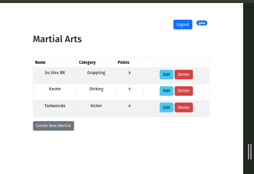
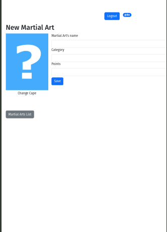

## A simple test project to study Flask creating a system to save Martial Arts :fire:

### Dependencies
- [FLASK](https://flask.palletsprojects.com/en/stable/)

- **Python** 3.10.1

- **Bootstrap** 5

- **Jquery** v3.7.1

- PostgreSQL

## How to Run

1. Install dependencies using [PIP](https://pypi.org/project/pip/)

2. Go to  `http://127.0.0.1:5000`